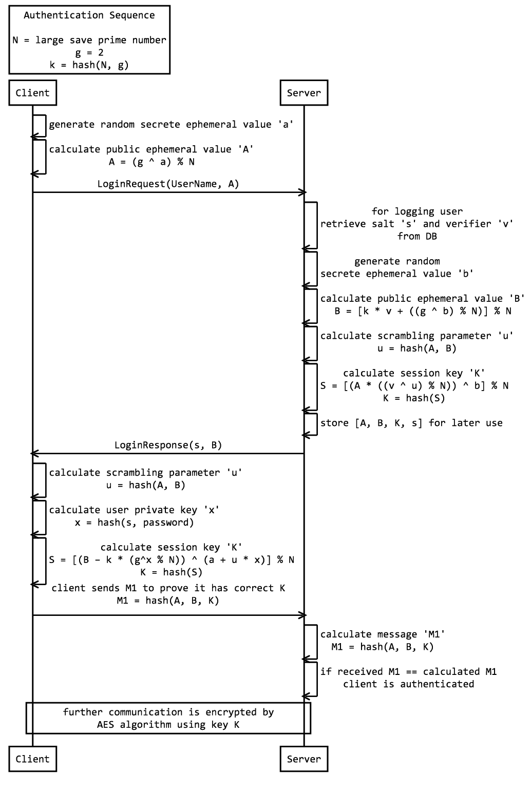

# Secure Remote Password (SRP) JavaScript Demo

This demo uses a combination of JavaScript and/or Java to demonstrate the mathematical steps behind the Secure Remote Password Protocol.

# Run demo locally

```
git clone git@github.com:hthetiot/srp-demo.git
cd srp-demo
npm install
npm run start
```

Then Open Browser on [http://localhost:8080](http://localhost:8080) to start demo.

# About Secure Remote Password (SRP)

    SRP is a protocol which was created by Thomas Wu at Stanford University to allow the secure authentication based on a user name and a password.
    The protocol is robust i.e. tolerates wide range of attacks, preventing an attack on any part or parts of the system from leading to further security compromises.

    It does not require any trusted third party (e.g. a certificate issuer or PKI) which makes it very comfortable to use.
    For technical details please refer to SRP home page or detailed SRP paper or protocol summary.

The following diagram shows how the SRP sequence is implemented in this example:



# Copyright

Copyright (c) 1997-2004  The Stanford SRP Authentication Project
All Rights Reserved.

See http://srp.stanford.edu/license.txt for details.

 Any use of this software to demo cryptographic technology other
than SRP must include the following acknowledgement:

    This software incorporates components derived from the
    Secure Remote Password JavaScript demo developed by
    Tom Wu (tjw@CS.Stanford.EDU).

